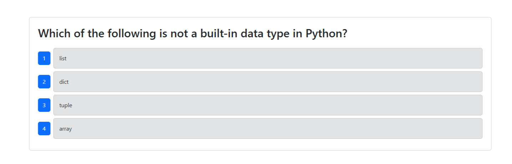

<h1 align="center">Welcome to GitHub-Pipeline Testing 👋</h1>
<p>
  
  <a href="https://github.com/Axe-P/GitHub-PipeLine" target="_blank">
  </a>
  <a href="https://github.com/Axe-P/GitHub-PipeLine/commits/main/" target="_blank">
    
  </a>
  <a href="https://opensource.org/license/mit" target="_blank">
    
</a>
</p>

> This project serves as a demonstration of the powerful capabilities of GitHub Actions. It highlights how GitHub Actions can assist the development workflow by automating various tasks, including the remote deployment of a website, and execution of automated tests. By leveraging this CI/CD (Continuous Integration and Continuous Deployment) tool, developers can focus more on writing code and less on the manual processes involved in deploying applications.

### 🏠 [Homepage / Deployed Site](https://github-pipeline.onrender.com)

## Usage

Use the provided website [here](https://github-pipeline.onrender.com).


## Run tests

```sh
npm run test-component
```

## Author

👤 **Axel Paxton**

* GitHub: [@Axe-P](https://github.com/Axe-P)

## 🤝 Contributing

Contributions, issues and feature requests are welcome!

## 📝 License

Copyright © 2024 [Axel Paxton](https://github.com/Axe-P).<br />
This project is [MIT](https://opensource.org/license/mit) licensed.


***
This README was generated with ❤️